<div align="center">

# Security Assessment & Control Design  
## Web-Based Student Management System

**A complete security-engineering case study for a Flask + SQLite academic portal — from vulnerable baseline to tested controls, risk reduction, and DevSecOps gates.**

<br/>


<br/>

> **Core idea:** Security is not only about fixing bugs.  
> It is about understanding how small weaknesses combine, measuring their risk, and building controls that stop the same class of mistakes from coming back.

</div>

---

## Table of Contents

- [1. What this project is about](#1-what-this-project-is-about)
- [2. Why this project matters](#2-why-this-project-matters)
- [3. System at a glance](#3-system-at-a-glance)
- [4. Security story in one diagram](#4-security-story-in-one-diagram)
- [5. Technology stack](#5-technology-stack)
- [6. Protected assets](#6-protected-assets)
- [7. Runtime architecture](#7-runtime-architecture)
- [8. Development and security pipeline](#8-development-and-security-pipeline)
- [9. Complete phase-wise lifecycle](#9-complete-phase-wise-lifecycle)
- [10. Phase 1 — Attack scenario design](#10-phase-1--attack-scenario-design)
- [11. Phase 2 — Vulnerable system development](#11-phase-2--vulnerable-system-development)
- [12. Phase 3 — Vulnerability assessment](#12-phase-3--vulnerability-assessment)
- [13. Phase 4 — CI/CD security integration](#13-phase-4--cicd-security-integration)
- [14. Phase 5 — STRIDE threat modeling](#14-phase-5--stride-threat-modeling)
- [15. Phase 6 — ALE risk quantification](#15-phase-6--ale-risk-quantification)
- [16. Phase 7 — Control design and fixes](#16-phase-7--control-design-and-fixes)
- [17. Phase 8 — Retesting and effectiveness analysis](#17-phase-8--retesting-and-effectiveness-analysis)
- [18. Design decisions and trade-offs](#18-design-decisions-and-trade-offs)
- [19. Repository structure](#19-repository-structure)
- [20. Local setup](#20-local-setup)
- [21. Security testing commands](#21-security-testing-commands)
- [22. GitHub Actions pipeline](#22-github-actions-pipeline)
- [23. Future improvements](#23-future-improvements)
- [24. Final takeaway](#24-final-takeaway)
- [25. References](#25-references)

---

# 1. What this project is about

This project is a full security assessment and control-design study for a **web-based Student Management System** built with **Python Flask** and **SQLite**.

The application represents a realistic academic portal where different users interact with sensitive records:

- students log in and view their profile;
- faculty members access student and academic records;
- administrators manage users, grades, attendance, and workflows;
- users upload academic or administrative documents.

Instead of starting from a perfectly secure application, this project intentionally begins with a **controlled vulnerable baseline**. That baseline is then assessed, modeled, prioritized, fixed, and retested.

This makes the project more realistic because real security work usually follows the same path:

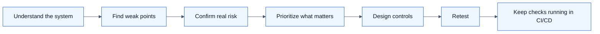

The project focuses on five connected weaknesses:

| No. | Weakness | What it means in this system |
|---:|---|---|
| 1 | Weak passwords | Accounts can be guessed or reused easily. |
| 2 | Account enumeration | Login messages reveal whether a username exists. |
| 3 | SQL injection | User input can influence database queries. |
| 4 | Weak sessions / RBAC | A normal user may reach privileged workflows. |
| 5 | Unsafe file uploads | Uploaded files can create storage, traversal, or persistence risk. |

---

# 2. Why this project matters

A Student Management System is not just a normal CRUD application. It contains records that directly affect students, faculty, and institutional trust.

A weakness in this kind of system can lead to:

| Impact Area | Example |
|---|---|
| Confidentiality loss | Student PII, credentials, grades, or attendance records are exposed. |
| Integrity loss | Grades, attendance, or profile records are modified without permission. |
| Privilege abuse | A student account reaches faculty/admin workflows. |
| Accountability failure | Important actions cannot be tied back to a user. |
| Long-term trust damage | The institution loses confidence in the correctness of academic records. |

The important lesson is that the five vulnerabilities are not isolated. They support each other.

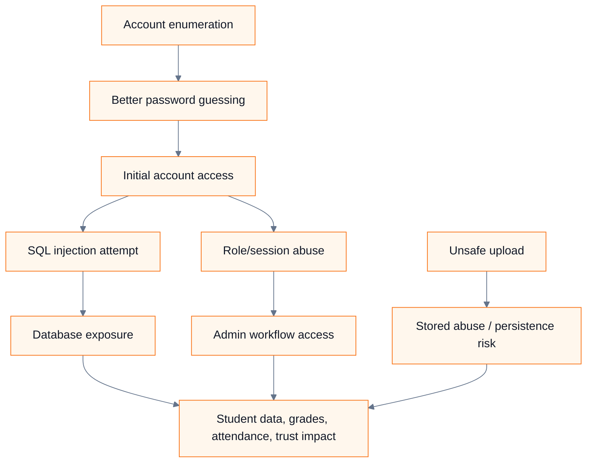

So the project treats security as a **connected system design problem**, not a random list of bugs.

---

# 3. System at a glance

## Application workflows

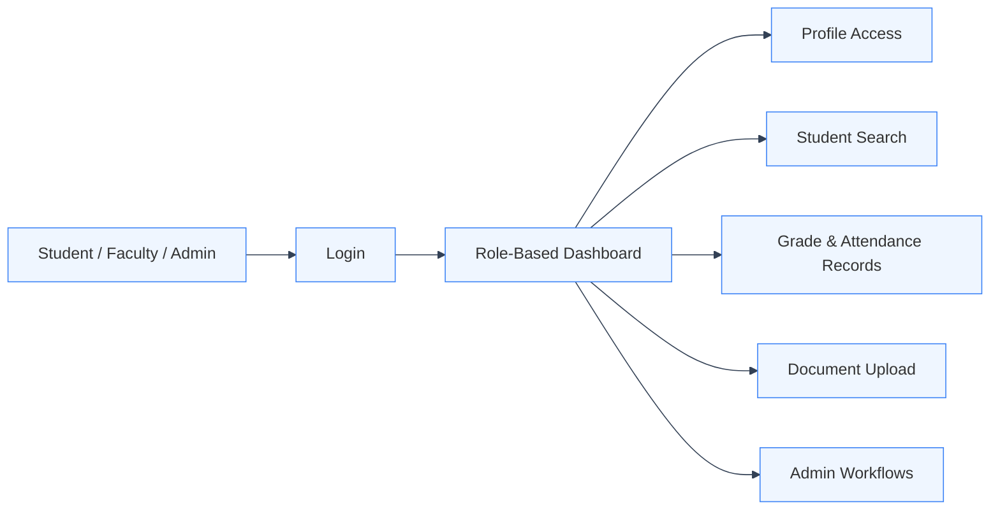

## What the project proves

By the end of the project, the system changes from this:

```text
Vulnerable prototype
    ↓
Raw SQL + weak passwords + distinguishable login errors
    ↓
Weak role/session trust + unsafe uploads
    ↓
High-risk attack chain
```

to this:

```text
Controlled secure prototype
    ↓
Parameterized SQL + bcrypt + unified auth errors
    ↓
Server-side RBAC + hardened sessions + safe upload pipeline
    ↓
CI/CD security gate + retesting evidence
```

---

# 4. Security story in one diagram

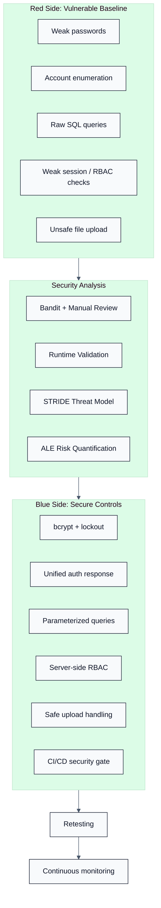

This is the overall journey of the project: build the vulnerable version, understand the risk properly, implement controls, and verify that the controls actually work.

---

# 5. Technology stack

| Layer | Chosen Technology | Why it fits this project |
|---|---|---|
| Backend | Flask | Small, readable, and ideal for showing route-level security decisions. |
| Database | SQLite | Simple local database for a controlled academic prototype. |
| Password security | bcrypt | Salted and intentionally slow password hashing. |
| Static analysis | Bandit | Python-focused SAST tool that works well in CI. |
| Runtime testing reference | OWASP ZAP | Useful for forms, sessions, headers, and HTTP behavior. |
| Threat modeling | STRIDE | Clean way to reason about identity, tampering, disclosure, availability, and privilege. |
| Risk quantification | ALE | Converts technical risk into expected annual business loss. |
| CI/CD | GitHub Actions-style pipeline | Automates tests, security scans, artifacts, and gates. |
| Upload safety | `secure_filename`, UUID names, allowlists | Reduces path traversal, filename collision, and unsafe storage risk. |

---

# 6. Protected assets

The system protects academic and identity-related data. These are the main assets considered during the assessment.

| Asset | Why it matters | Primary security property |
|---|---|---|
| Student PII | Contains personal and identity-related information. | Confidentiality |
| Grades | Academic results must remain correct. | Integrity |
| Attendance records | Used for academic tracking and decisions. | Integrity + Availability |
| Credentials | Control access to student, faculty, and admin areas. | Confidentiality |
| Uploaded documents | May contain sensitive submissions or forms. | Integrity + Storage safety |
| Admin workflows | Allow privileged changes to users and records. | Authorization |
| Audit records | Help prove who performed important actions. | Accountability |

---

# 7. Runtime architecture

## Production-style architecture

For local testing, Flask can run directly. But in a production-style deployment, Flask should not be the public entry point. A safer design places a reverse proxy or API gateway in front of the application.

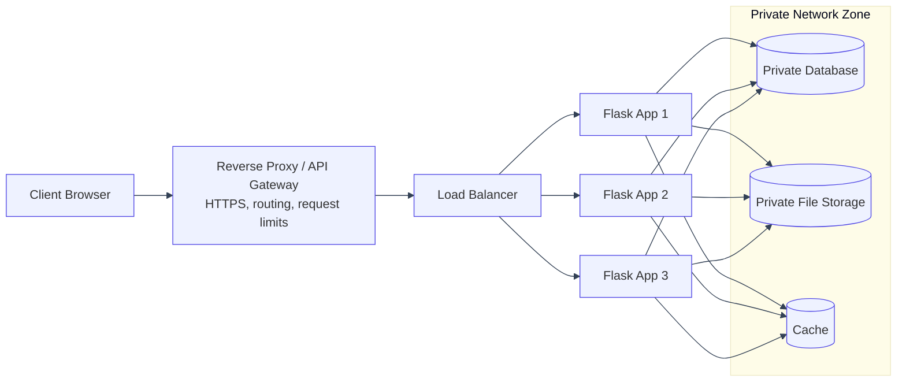

## Why this layout is safer

| Component | Placement | Reason |
|---|---|---|
| Reverse proxy / API gateway | First server-side layer | Handles HTTPS, routing, request limits, and basic edge controls. |
| Load balancer | Behind proxy | Distributes traffic and improves availability. |
| Flask app cluster | Application layer | Runs business logic, authentication, authorization, validation, and upload handling. |
| Database | Private data layer | Not exposed directly to public traffic. |
| File storage | Private storage layer | Uploads stay controlled behind the application. |
| Cache | Private layer | Speeds up reads and reduces pressure on the database. |

## Architecture decision

Direct Flask exposure is acceptable for a classroom demo, but not for a safer production-style system. The reverse proxy gives the application a controlled front door, while private database and storage reduce the blast radius if the public-facing layer is attacked.

---

# 8. Development and security pipeline

Security is built into the delivery process. The pipeline does not wait until the final report to check for risk.

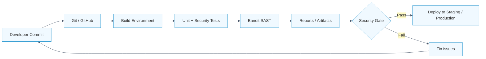

## Why this matters

Manual review is useful, but it is not enough. If security checks are not repeated, the same mistakes can return in later commits. The CI/CD gate makes security a normal part of development.

---

# 9. Complete phase-wise lifecycle

| Phase | Question answered | Output |
|---:|---|---|
| 1 | How could an attacker realistically move through the system? | Attack scenario and MITRE-style path. |
| 2 | Where are the weaknesses present in the prototype? | Vulnerable Flask + SQLite baseline. |
| 3 | Which weaknesses are confirmed and how severe are they? | Vulnerability assessment and CVSS reasoning. |
| 4 | How can checks be repeated automatically? | CI/CD security pipeline and policy gates. |
| 5 | What can go wrong across identity, data, availability, and privilege? | STRIDE threat model. |
| 6 | Which risks deserve priority based on expected loss? | ALE-based risk quantification. |
| 7 | Which controls break the attack chain? | Secure coding and defense-in-depth controls. |
| 8 | Did the controls actually reduce risk? | Retesting and effectiveness analysis. |

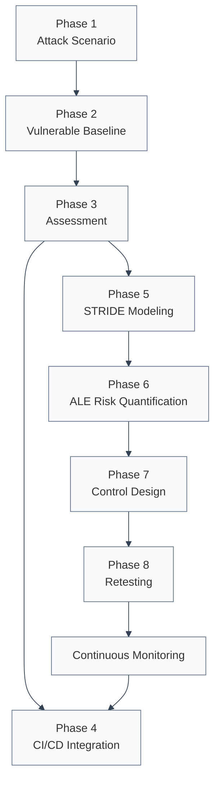

---

# 10. Phase 1 — Attack scenario design

## Purpose

The first phase turns the five scoped weaknesses into a single realistic attack chain. This helps explain why the final risk is bigger than any one bug.

## Attack path

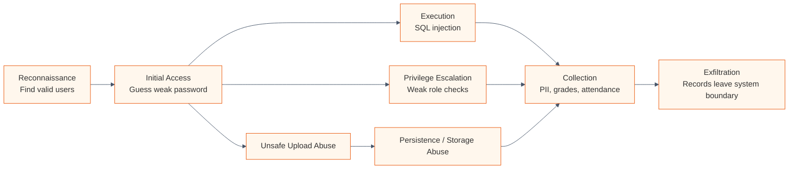

## Mapping to project weaknesses

| Attack stage | Attacker goal | Weakness used | Impact |
|---|---|---|---|
| Reconnaissance | Identify real users | Account enumeration | Valid student/faculty/admin usernames become known. |
| Initial access | Enter the system | Weak passwords | One weak account becomes a foothold. |
| Execution | Make backend input affect logic | SQL injection | Queries may expose or alter records. |
| Privilege escalation | Reach restricted workflows | Weak session/RBAC | A normal user may reach admin/faculty functionality. |
| Collection | Gather useful data | SQL injection + privileged access | PII, grades, attendance, or credentials may be collected. |
| Persistence risk | Keep a durable abuse point | Unsafe upload | Stored files may become a long-term storage risk. |

## Why the attack-chain model was chosen

A checklist would show the five bugs, but it would not show how they help each other. The attack-chain model was chosen because it explains the real security story:

> enumeration makes guessing easier, guessing creates access, access enables injection or role abuse, and unsafe uploads may make the risk last longer.

---

# 11. Phase 2 — Vulnerable system development

## Purpose

The second phase builds the intentionally vulnerable prototype. It behaves like a small student portal, but some security controls are deliberately missing so that the weaknesses can be assessed and fixed later.

## Vulnerable application architecture

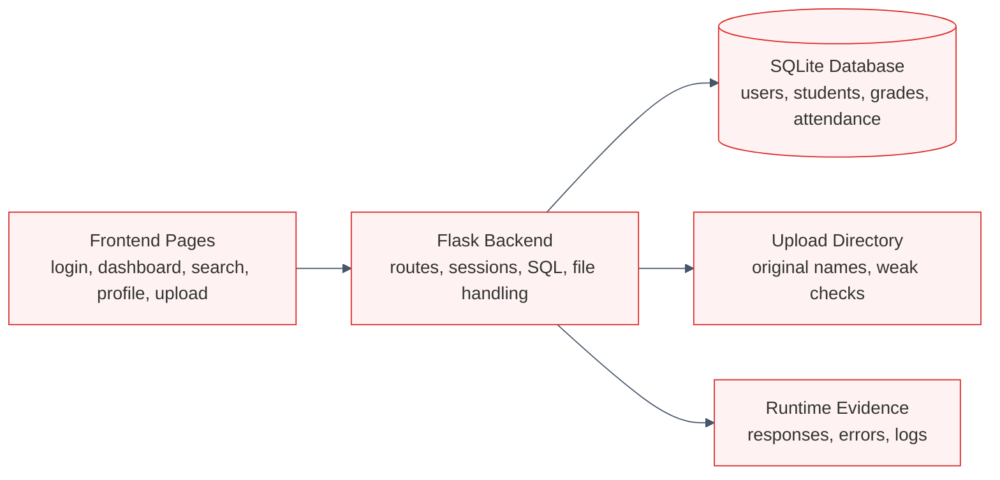

## Implemented features and their security relevance

| Feature | Normal purpose | Security issue demonstrated |
|---|---|---|
| Login | Authenticate users | Weak passwords, enumeration, SQL injection risk. |
| Role dashboards | Separate student/faculty/admin workflows | Session trust and privilege escalation. |
| Search | Look up student records | SQL injection through user input. |
| Profile access | Show user-specific records | Need for object-level authorization. |
| File upload | Submit academic documents | Unsafe naming, extension, and path handling. |

## Scoped vulnerability map

| Entry point | Intentional weakness | Likely impact | OWASP relation |
|---|---|---|---|
| Login form | Weak passwords, no lockout | Account compromise | A07 |
| Login response | Different messages for username/password failure | Username discovery | A07 / A01 |
| Login/search SQL | Raw SQL built with input | Data exposure or tampering | A03 |
| Dashboard/admin route | Role trusted from weak state | Privilege escalation | A01 |
| Upload route | No strict allowlist or safe storage name | Unsafe storage or persistence | A05 / A01 |

---

# 12. Phase 3 — Vulnerability assessment

## Purpose

This phase turns the vulnerable implementation into confirmed findings. The assessment does not blindly trust scanner output. A finding is treated as meaningful only when it is reachable, influenced by user input, and connected to an important asset.

## Assessment flow

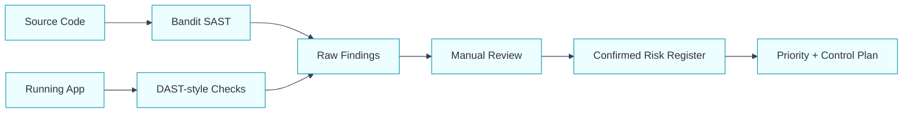

## Evidence funnel

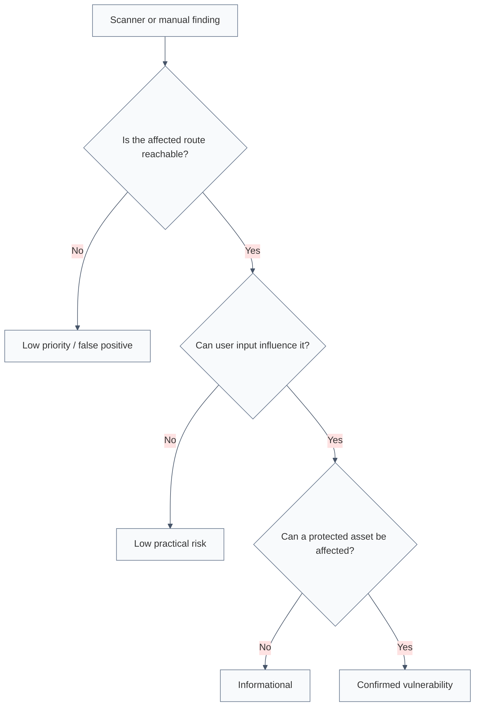

## Assessment methods

| Method | What it gives | Why it was included |
|---|---|---|
| Bandit SAST | Finds insecure Python patterns. | Fast, repeatable, CI-friendly. |
| DAST-style runtime checks | Shows behavior from the outside. | Useful for login messages, sessions, headers, uploads. |
| Manual review | Adds context. | Confirms reachability and business impact. |
| Runtime validation | Observes the actual prototype. | Proves the weakness appears in the workflow. |

## Confirmed vulnerability summary

| Vulnerability | Why it was confirmed | CVSS | Severity |
|---|---|---:|---|
| SQL injection | User input was inserted directly into SQL strings. | 9.8 | Critical |
| Unvalidated uploads | Files lacked strict type, name, and path controls. | 9.0 | Critical |
| Session/RBAC weakness | Role trust could be influenced by weak state. | 8.8 | High |
| Weak passwords | Simple credentials and no lockout made guessing realistic. | 8.1 | High |
| Account enumeration | Login responses revealed username validity. | 6.5 | Medium |

---

# 13. Phase 4 — CI/CD security integration

## Purpose

This phase makes the security checks repeatable. Instead of checking once and forgetting, every change goes through automated security validation.

## Security gate flow

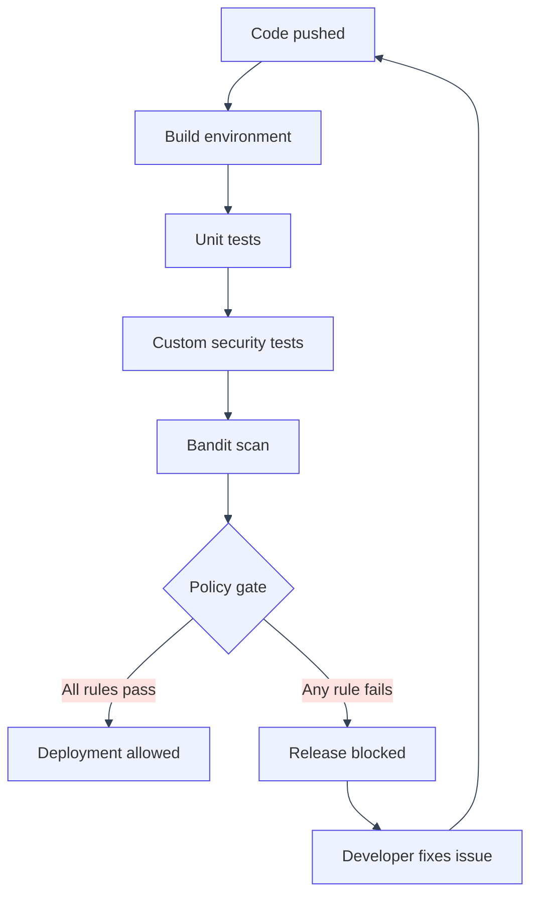

## Security gate rules

| Risk | Gate rule | Expected fix |
|---|---|---|
| SQL injection | Fail if user input is used in formatted/concatenated SQL. | Parameterized queries. |
| Account enumeration | Fail if username and password failures produce different messages. | Unified authentication error. |
| Session/RBAC | Fail if protected routes trust URL role values or skip server-side checks. | Database-backed role and reusable RBAC decorator. |
| Unsafe upload | Fail if upload lacks allowlist, safe naming, or path boundary check. | Extension allowlist, UUID names, realpath validation. |
| Weak passwords | Warn/fail if plaintext or weak default credentials remain. | bcrypt hashing and lockout/throttling. |

---

# 14. Phase 5 — STRIDE threat modeling

## Purpose

STRIDE makes the threat model systematic. Instead of randomly listing attacks, it asks six questions for every important component:

- Can someone pretend to be another user?
- Can someone change data without permission?
- Can someone deny an action because evidence is weak?
- Can confidential data be exposed?
- Can the system be made unavailable?
- Can a user gain more privilege than allowed?

## STRIDE workflow

```mermaid
%%{init: {'theme': 'base', 'themeVariables': { 'primaryColor': '#f5f3ff', 'primaryBorderColor': '#7c3aed', 'secondaryColor': '#f8fafc', 'tertiaryColor': '#dcfce7', 'lineColor': '#334155'}}}%%
flowchart LR
    Context[Define system context] --> Components[Map components]
    Components --> Questions[Ask STRIDE questions]
    Questions --> Threats[Identify threats]
    Threats --> Assets[Map to assets]
    Assets --> Controls[Design controls]
    Controls --> Retest[Retest]
```

## STRIDE categories in this system

| Category | Meaning | Student Management System example |
|---|---|---|
| Spoofing | Pretending to be another identity. | Logging in using guessed student/faculty/admin credentials. |
| Tampering | Changing data without permission. | SQL injection modifies grades or profiles. |
| Repudiation | Denying an action due to weak evidence. | Admin action cannot be tied to a user/time. |
| Information disclosure | Exposing confidential data. | PII, grades, or attendance records leak. |
| Denial of service | Making the system unavailable or slow. | Repeated login attempts or expensive queries degrade the app. |
| Elevation of privilege | Gaining more access than assigned. | Student reaches admin/faculty workflows. |

## Threat mapping by component

| Component | STRIDE concern | Vulnerability link |
|---|---|---|
| Login/authentication | Spoofing, information disclosure | Weak passwords + account enumeration |
| Session/role handling | Spoofing, elevation of privilege | Weak session/RBAC |
| Search/query layer | Tampering, information disclosure | SQL injection |
| Database | Disclosure, tampering | SQL injection + weak storage assumptions |
| File upload module | Tampering, persistence risk | Unsafe uploads |
| Admin workflows | Repudiation, EoP | Weak audit + RBAC gaps |
| Availability | DoS | No lockout/rate limiting |

---

# 15. Phase 6 — ALE risk quantification

## Purpose

Threat modeling explains what can go wrong. ALE explains how much loss the organization may expect if the risk remains.

## Formula

```text
SLE = Asset Value × Exposure Factor
ALE = SLE × Annual Rate of Occurrence
ALE = Asset Value × Exposure Factor × Annual Rate of Occurrence
```

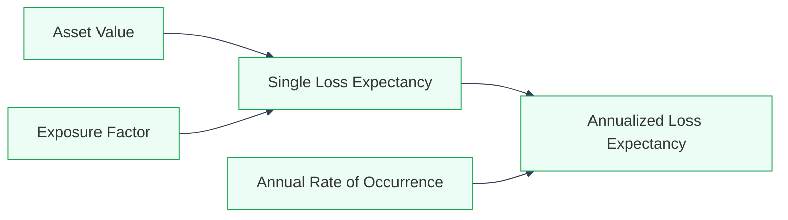

## Pre-control ALE table

Asset value used: **₹50,00,000**

| Risk | Asset Value | Exposure Factor | ARO | ALE |
|---|---:|---:|---:|---:|
| SQL injection | ₹50,00,000 | 0.80 | 2.0 | ₹80,00,000 |
| Session/RBAC weakness | ₹50,00,000 | 0.75 | 1.0 | ₹37,50,000 |
| Weak passwords | ₹50,00,000 | 0.35 | 2.0 | ₹35,00,000 |
| Unvalidated uploads | ₹50,00,000 | 0.50 | 1.2 | ₹30,00,000 |
| Account enumeration | ₹50,00,000 | 0.25 | 1.5 | ₹18,75,000 |

## Priority order

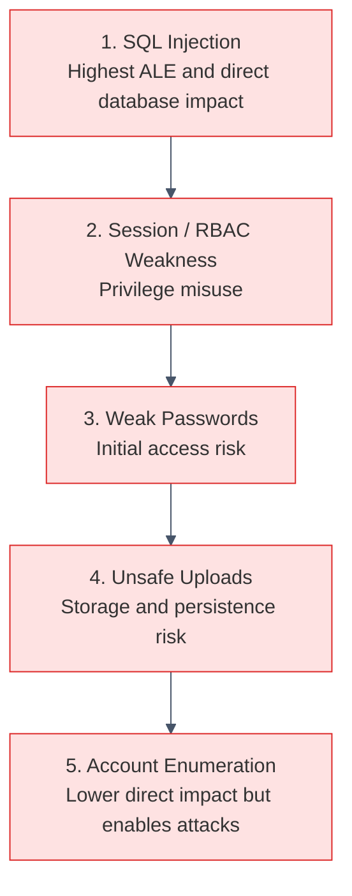

---

# 16. Phase 7 — Control design and fixes

## Purpose

This phase replaces insecure behavior with reusable controls. The goal is not to fix one line and move on. The goal is to prevent the same vulnerability class from returning.

## Secure control map

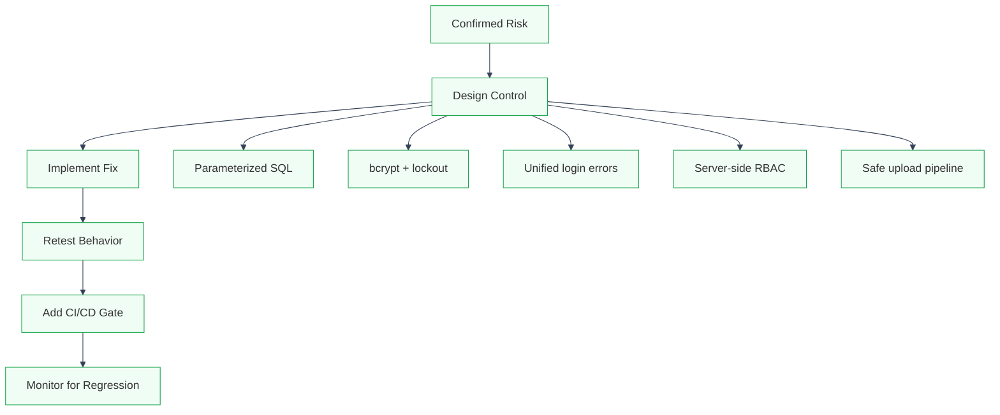

## Vulnerability-to-control mapping

| Vulnerability | Before | After | Risk reduced |
|---|---|---|---|
| SQL injection | Raw SQL with user input. | Parameterized queries. | Database disclosure and tampering. |
| Weak passwords | Weak/plain passwords, no lockout. | bcrypt + failed-attempt threshold. | Credential guessing and database leak impact. |
| Account enumeration | Different login errors. | Same error for all auth failures. | Username discovery. |
| Session/RBAC weakness | Role trusted from request/session state. | Role loaded from DB and checked server-side. | Privilege escalation. |
| Unsafe uploads | Original filename and weak checks. | Allowlist, UUID rename, safe path validation. | Traversal, collisions, unsafe storage. |

## Before and after examples

### SQL injection control

```python
# Before: vulnerable query construction
query = f"SELECT * FROM users WHERE username='{username}' AND password='{password}'"
user = db.execute(query).fetchone()

# After: query structure is fixed, input is passed as data
user = db.execute(
    "SELECT * FROM users WHERE username = ?",
    (username,)
).fetchone()
```

### Password hardening

```python
# Before: direct plaintext comparison
if password == stored_password:
    login_success()

# After: bcrypt verification and failed-attempt tracking
if bcrypt.checkpw(input_password.encode(), stored_hash.encode()):
    login_success()
else:
    increment_failed_attempts(user_id)
    lock_account_temporarily_after_threshold(user_id, threshold=5)
```

### Unified authentication response

```python
# Before: distinguishable messages
if user_exists:
    error = "Incorrect password"
else:
    error = "No account found"

# After: same message for all authentication failures
error = "Invalid username or password."
```

### Server-side role enforcement

```python
# Before: role can be influenced by request state
role = request.args.get("role", session.get("role", "student"))
session["role"] = role

# After: role is loaded from trusted server-side data
role = load_role_from_database(user_id)
session["role"] = role

@role_required("admin")
def admin_panel():
    return show_admin_panel()
```

### Safer upload handling

```python
filename = secure_filename(file.filename)
validate_extension(filename, allowlist={"pdf", "docx", "xlsx", "png", "jpg", "txt"})

stored_name = f"{uuid4()}{safe_extension(filename)}"
filepath = safe_join_upload_directory(stored_name)
verify_realpath_stays_inside_upload_folder(filepath)

file.save(filepath)
```

## Defense in depth view

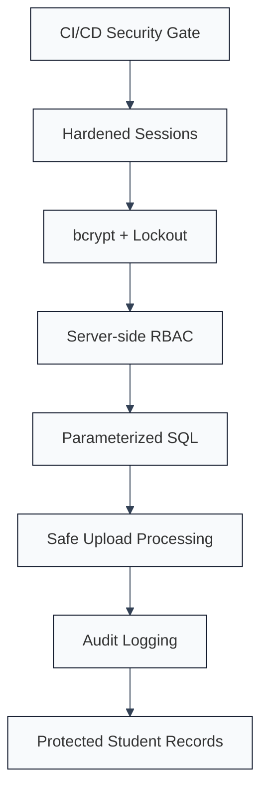

---

# 17. Phase 8 — Retesting and effectiveness analysis

## Purpose

Retesting checks whether the controls actually changed application behavior. A control only matters if it blocks the same conditions that exposed the original weakness.

## Retesting workflow

```mermaid
%%{init: {'theme': 'base', 'themeVariables': { 'primaryColor': '#f0fdf4', 'primaryBorderColor': '#22c55e', 'secondaryColor': '#eff6ff', 'tertiaryColor': '#fefce8', 'lineColor': '#334155'}}}%%
flowchart LR
    Original[Original Findings] --> Fix[Apply Controls]
    Fix --> Bandit[Re-run Bandit]
    Bandit --> Tests[Re-run Security Tests]
    Tests --> Manual[Manual Runtime Validation]
    Manual --> Compare[Compare Before vs After]
    Compare --> Residual[Residual Risk Register]
```

## Before-and-after effectiveness

| Vulnerability | Before | After | Effectiveness |
|---|---|---|---|
| SQL injection | User input changed SQL meaning. | Payloads treated as data. | High |
| Weak passwords | Simple credentials and no lockout. | bcrypt hashes and failure threshold. | High |
| Account enumeration | Login errors revealed valid users. | Same error for all failures. | High |
| Session/RBAC weakness | Role influenced by weak state. | Server-side route authorization. | High |
| Unsafe uploads | Original names and weak checks. | Allowlist, UUID names, path checks. | High |
| Logging/repudiation | Actions difficult to trace. | Security actions logged with user/time context. | Medium to High |

## Residual risks

| Residual risk | Why it remains | Future control |
|---|---|---|
| Password reuse | Users may reuse leaked passwords from other services. | MFA, breached-password checks. |
| Malicious file content | Extension allowlist does not prove content is safe. | MIME validation, antivirus scanning, content inspection. |
| SQLite limitations | SQLite is suitable for prototype, not large production use. | PostgreSQL/MySQL. |
| Dependency vulnerabilities | New vulnerabilities can appear later. | Dependabot, pip-audit, dependency review. |
| Logging gaps | Basic logs may not support deep forensics. | Structured audit logs and SIEM integration. |
| Abuse/rate pressure | Lockout helps but may not stop all automated abuse. | IP/user rate limiting and anomaly detection. |

---

# 18. Design decisions and trade-offs

This section explains why specific choices were made instead of simply listing them.

## 18.1 Flask over Django or FastAPI

| Option | Strength | Why not selected as primary |
|---|---|---|
| Flask | Simple, transparent, route-level logic is easy to inspect. | Selected. |
| Django | Strong built-in security and admin support. | Too much security behavior is hidden for this teaching-focused prototype. |
| FastAPI | Modern, typed, fast. | Less aligned with the simple academic portal style of this project. |

**Decision:** Flask was chosen because the project needed security decisions to be visible in the code.

## 18.2 SQLite over PostgreSQL/MySQL

| Option | Strength | Limitation |
|---|---|---|
| SQLite | Easy local setup, no server required. | Not ideal for production-scale multi-user deployments. |
| PostgreSQL | Strong production database. | More setup overhead for a lab prototype. |
| MySQL | Common production option. | Adds administration work outside project focus. |

**Decision:** SQLite was chosen to keep the prototype lightweight and reproducible.

## 18.3 Bandit over manual-only review

| Approach | Strength | Limitation |
|---|---|---|
| Manual-only review | Context-rich. | Not repeatable. |
| Bandit-only scanning | Repeatable. | Cannot fully understand business impact. |
| Bandit + manual validation | Repeatable and context-aware. | Selected. |

**Decision:** Bandit provides automated feedback, while manual review confirms real risk.

## 18.4 STRIDE over only OWASP Top 10

OWASP Top 10 is excellent for web vulnerability categories, but STRIDE gives a broader architecture-level view. STRIDE was chosen because it naturally covers identity, tampering, accountability, confidentiality, availability, and privilege.

## 18.5 ALE over severity labels only

High/medium/low labels are easy to read, but they do not show expected business loss. ALE was used because it gives a stronger prioritization story.

## 18.6 Parameterized SQL over input filtering alone

Filtering can help, but it is fragile. Parameterized queries are stronger because they separate SQL structure from user data.

## 18.7 bcrypt over fast hashing

Fast hashes are bad for passwords because attackers can test guesses quickly. bcrypt is intentionally slow and salted, making offline cracking harder.

## 18.8 Server-side RBAC over client/session-trusted roles

Authorization must be decided by trusted server-side data. URL parameters, form fields, and weak session values should never decide admin access.

## 18.9 UUID filenames over original filenames

Original filenames can collide, leak information, or contain unsafe characters. UUID storage names make uploads safer and more predictable for the server.

## 18.10 CI/CD gate over one-time testing

One-time testing only proves the current version. CI/CD gates help prevent future regressions.

---

# 19. Repository structure

```text
student-management-security-project/
│
├── app/
│   ├── __init__.py
│   ├── routes.py
│   ├── auth.py
│   ├── models.py
│   ├── db.py
│   ├── upload_utils.py
│   └── security.py
│
├── templates/
│   ├── login.html
│   ├── dashboard.html
│   ├── student_profile.html
│   ├── search.html
│   └── upload.html
│
├── static/
│   ├── css/
│   └── js/
│
├── uploads/
│   └── .gitkeep
│
├── tests/
│   ├── test_auth.py
│   ├── test_rbac.py
│   ├── test_sql_safety.py
│   ├── test_uploads.py
│   └── security/
│       ├── test_no_account_enumeration.py
│       ├── test_admin_route_protection.py
│       └── test_upload_path_safety.py
│
├── reports/
│   ├── bandit-report.json
│   ├── bandit-report.html
│   └── retesting-summary.md
│
├── docs/
│   ├── threat-model.md
│   ├── risk-register.md
│   ├── ale-calculation.md
│   └── control-mapping.md
│
├── .github/
│   └── workflows/
│       └── security.yml
│
├── requirements.txt
├── README.md
├── run.py
└── config.py
```

---

# 20. Local setup

## 1. Clone the repository

```bash
git clone <repository-url>
cd student-management-security-project
```

## 2. Create a virtual environment

```bash
python -m venv .venv
```

## 3. Activate the environment

Windows:

```bash
.venv\Scripts\activate
```

macOS/Linux:

```bash
source .venv/bin/activate
```

## 4. Install dependencies

```bash
pip install -r requirements.txt
```

## 5. Initialize the database

```bash
python init_db.py
```

## 6. Run the application

```bash
python run.py
```

Open:

```text
http://127.0.0.1:5000
```

---

# 21. Security testing commands

## Run Bandit

```bash
bandit -r .
```

## Generate JSON report

```bash
mkdir -p reports
bandit -r . -f json -o reports/bandit-report.json
```

## Generate HTML report

```bash
mkdir -p reports
bandit -r . -f html -o reports/bandit-report.html
```

## Run all tests

```bash
pytest
```

## Run security tests only

```bash
pytest tests/security
```

## Recommended local pre-push check

```bash
bandit -r . && pytest tests/security
```

---

# 22. GitHub Actions pipeline

```yaml
name: SMS Security Pipeline

on:
  push:
  pull_request:

jobs:
  security-scan:
    runs-on: ubuntu-latest

    steps:
      - name: Checkout repository
        uses: actions/checkout@v4

      - name: Set up Python
        uses: actions/setup-python@v5
        with:
          python-version: "3.x"

      - name: Install dependencies
        run: |
          python -m pip install --upgrade pip
          pip install -r requirements.txt
          pip install bandit pytest

      - name: Run Bandit SAST
        run: |
          mkdir -p reports
          bandit -r . -f json -o reports/bandit-report.json --severity-level medium

      - name: Run custom security tests
        run: pytest tests/security

      - name: Upload security reports
        uses: actions/upload-artifact@v4
        with:
          name: security-reports
          path: reports/
```

---

# 23. Future improvements

| Area | Improvement |
|---|---|
| Authentication | MFA, secure password reset, breached-password screening. |
| Sessions | Server-side session storage, stricter expiration, rotation on login. |
| Authorization | Object-level authorization for every student record. |
| Database | PostgreSQL/MySQL for production. |
| File uploads | MIME validation, malware scanning, size limits, content inspection. |
| Monitoring | Structured audit logs, alerting, SIEM integration. |
| Dependency security | pip-audit, Dependabot, dependency pinning policy. |
| DAST automation | OWASP ZAP baseline scan in CI. |
| Secrets | Environment variables or secrets manager. |
| Deployment | HTTPS enforcement, secure headers, WAF/rate limiting, container hardening. |
| Testing | Regression tests for every fixed vulnerability class. |

---

# 24. Final takeaway

This project shows the full journey of secure software engineering:

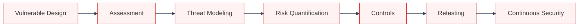

The insecure baseline demonstrates how normal development shortcuts can become serious security failures. The secure version shows how those failures can be addressed through reusable controls:

- account enumeration is removed through unified login responses;
- weak passwords are reduced through bcrypt and lockout;
- SQL injection is blocked through parameterized queries;
- privilege escalation is reduced through server-side RBAC;
- unsafe upload risk is reduced through allowlists, UUID names, and safe paths;
- regression risk is reduced through CI/CD security gates.

The main lesson is simple:

> A secure system is not created by one patch.  
> It is created by layered controls, repeatable checks, and design decisions that make unsafe behavior harder to reintroduce.

---

# 25. References

- OWASP Foundation — OWASP Top 10 Web Application Security Risks
- MITRE — MITRE ATT&CK Framework
- Microsoft — STRIDE Threat Modeling Methodology
- NIST — Secure Software Development Framework
- PyCQA — Bandit Python Security Linter Documentation
- OWASP — Zed Attack Proxy Documentation
- Flask Project — Flask Web Framework Documentation
- bcrypt Project — Password Hashing and Verification

---

<div align="center">

**Security Assessment and Control Design for a Web-Based Student Management System**  


</div>
